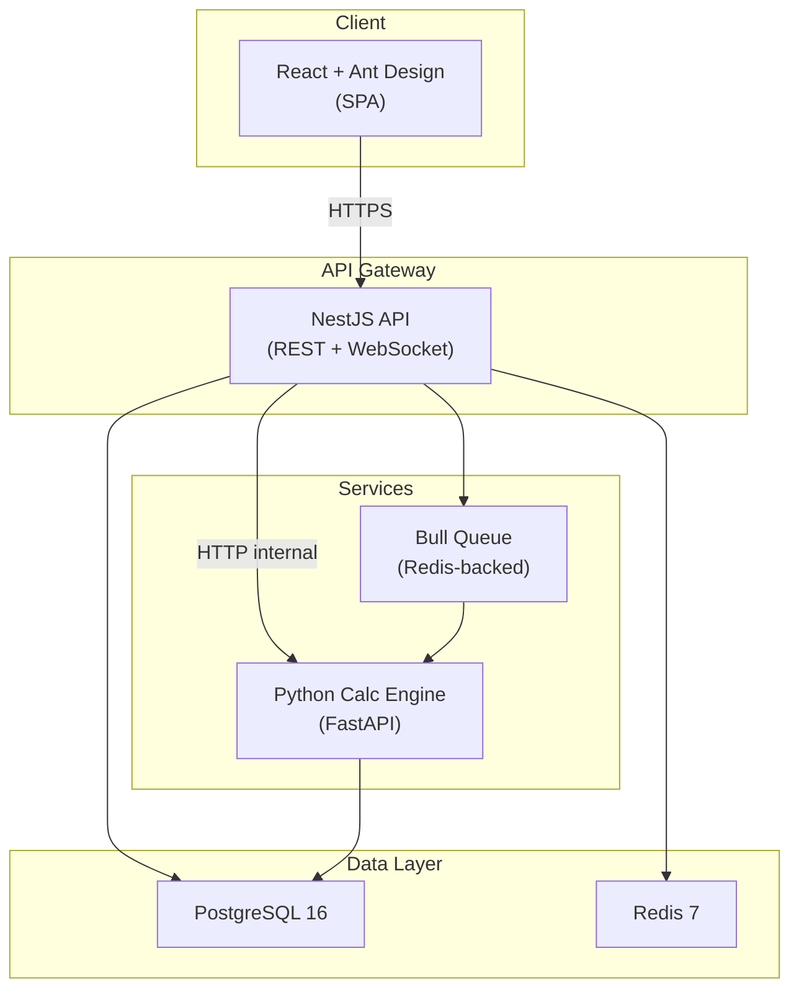
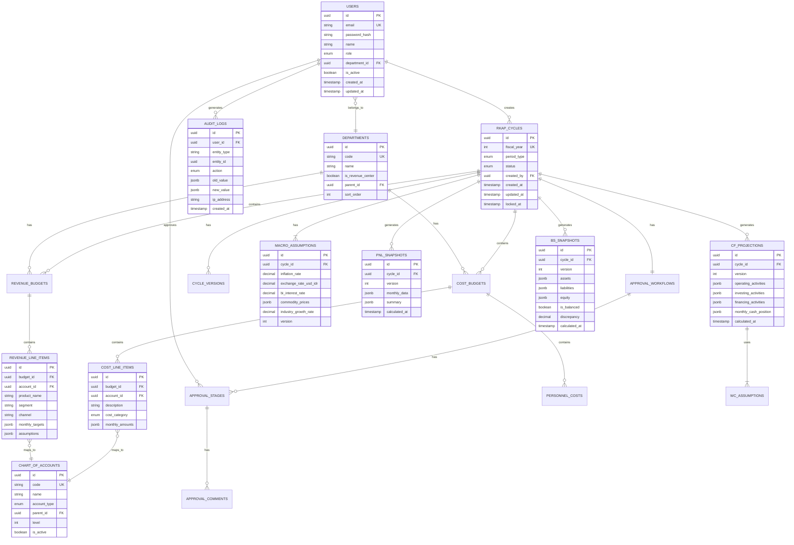
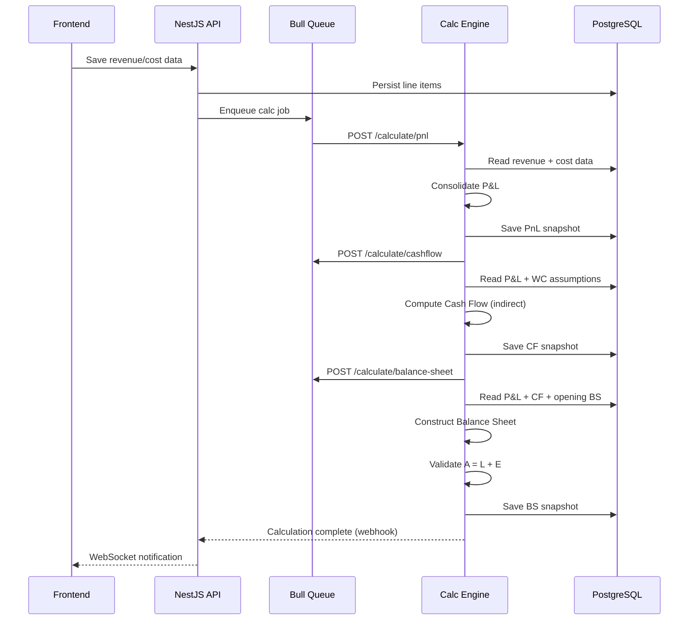

# RKAP — Corporate Financial Planning Application

> Implementation Plan for **MVP (Fase 1 — Q3 2026)**

## Overview

Build an integrated web application that replaces spreadsheet-based RKAP processes. The MVP delivers the **Must Have** features: RKAP cycle management, revenue & cost budgeting, P&L projection, Cash Flow (indirect method), basic Balance Sheet, approval workflow, and Excel/PDF export — all in one platform with audit trails and role-based access.

---

## User Review Required

> [!IMPORTANT]
> **Tech Stack Decisions** — The plan uses the following stack based on your input and PRD recommendations. Please confirm or override:
> - **Frontend**: React 18 + TypeScript + **Ant Design 5** (best enterprise table/form components for financial data)
> - **Backend**: Node.js + **NestJS** (TypeScript, confirmed by you)
> - **Calculation Engine**: Python **FastAPI** microservice with NumPy/Pandas (dedicated service for heavy financial computations)
> - **Database**: PostgreSQL 16 + Redis 7
> - **Monorepo**: Turborepo (shared TS types between frontend & backend)
> - **Deployment**: Docker Compose (confirmed by you)

> [!WARNING]
> **Scope Boundary** — This plan covers **Fase 1 (MVP) only**. The following are explicitly excluded:
> - CapEx Budget & Depreciation (Fase 2)
> - Executive Dashboard (Fase 2)
> - Scenario Analysis (Fase 2)
> - Multi-currency (Fase 2)
> - Direct Cash Flow method (Fase 3)
> - Driver-based budgeting (Fase 3)
> - SSO/LDAP integration (Fase 4 — MVP uses email+password with JWT)
> - MFA (Fase 4)

## Open Questions

> [!IMPORTANT]
> 1. **Chart of Accounts (CoA)**: Should the MVP include a CoA import feature (CSV/Excel upload), or will CoA be manually configured through the admin UI?
> 2. **Number of departments**: What is the typical number of departments per company? This affects UI design (tab-based vs. tree-based navigation).
> 3. **Currency**: The MVP excludes multi-currency. Should we default to **IDR (Indonesian Rupiah)** as the sole currency?
> 4. **Historical data import**: Should the MVP support importing historical financial data for year-over-year comparison, or is this a Phase 2 feature?
> 5. **Email provider**: For notifications — should we integrate SendGrid, or use a generic SMTP configuration?

---

## Architecture Overview



---

## Proposed Changes

### 1. Monorepo Foundation & Tooling

Set up the Turborepo monorepo with shared packages, linting, and Docker configuration.

```
d:\MyProject\CorPlan\
├── turbo.json
├── package.json                    # Root workspace config
├── .env.example
├── docker-compose.yml
├── docker-compose.dev.yml
├── .gitignore
├── .eslintrc.js
├── .prettierrc
├── tsconfig.base.json              # Shared TS config
│
├── packages/
│   └── shared-types/               # Shared TypeScript types
│       ├── package.json
│       ├── tsconfig.json
│       └── src/
│           ├── index.ts
│           ├── rkap-cycle.types.ts
│           ├── revenue.types.ts
│           ├── cost.types.ts
│           ├── pnl.types.ts
│           ├── cashflow.types.ts
│           ├── balance-sheet.types.ts
│           ├── workflow.types.ts
│           ├── user.types.ts
│           └── common.types.ts
│
├── apps/
│   ├── web/                        # React frontend
│   ├── api/                        # NestJS backend
│   └── calc-engine/                # Python calculation service
│
├── docker/
│   ├── api.Dockerfile
│   ├── web.Dockerfile
│   ├── calc-engine.Dockerfile
│   └── nginx.conf
│
└── docs/
    ├── api-spec.yaml               # OpenAPI 3.0 spec
    └── db-schema.md
```

#### [NEW] [turbo.json](file:///d:/MyProject/CorPlan/turbo.json)
Turborepo pipeline configuration — `build`, `dev`, `lint`, `test`, `typecheck` pipelines with proper dependency ordering.

#### [NEW] [package.json](file:///d:/MyProject/CorPlan/package.json)
Root workspace with `pnpm` workspaces pointing to `apps/*` and `packages/*`.

#### [NEW] [docker-compose.yml](file:///d:/MyProject/CorPlan/docker-compose.yml)
Production-like compose with services: `web`, `api`, `calc-engine`, `postgres`, `redis`, `nginx` (reverse proxy).

#### [NEW] [docker-compose.dev.yml](file:///d:/MyProject/CorPlan/docker-compose.dev.yml)
Development override — hot-reloading, volume mounts, exposed debug ports.

---

### 2. Shared Types Package (`packages/shared-types`)

TypeScript type definitions shared between frontend and backend, ensuring type safety across the entire stack.

#### [NEW] [rkap-cycle.types.ts](file:///d:/MyProject/CorPlan/packages/shared-types/src/rkap-cycle.types.ts)
- `RkapCycle` — core entity: `id`, `year`, `status` (Draft | InReview | Approved | Published | Locked), `macroAssumptions`, `createdBy`, `versions[]`
- `MacroAssumptions` — `inflationRate`, `exchangeRateUsdIdr`, `biInterestRate`, `commodityPrices`, `industryGrowthRate`
- `CycleStatus` enum, `CyclePeriod` enum (Annual | Quarterly | Monthly)

#### [NEW] [revenue.types.ts](file:///d:/MyProject/CorPlan/packages/shared-types/src/revenue.types.ts)
- `RevenueBudget` — per segment/product/channel with monthly breakdown
- `RevenueLineItem` — `productName`, `segment`, `channel`, `monthlyTargets[12]`, `assumptions` (volume, price, discount)

#### [NEW] [cost.types.ts](file:///d:/MyProject/CorPlan/packages/shared-types/src/cost.types.ts)
- `CostBudget` — per department, categorized as Fixed | Variable | SemiVariable
- `CostLineItem` — `accountCode`, `accountName`, `category`, `department`, `monthlyAmounts[12]`
- `PersonnelCost` — `headcount`, `salary`, `allowances`, `bpjs`

#### [NEW] [pnl.types.ts](file:///d:/MyProject/CorPlan/packages/shared-types/src/pnl.types.ts)
- `PnlProjection` — consolidated P&L with monthly/quarterly/annual views
- `PnlSummary` — `grossRevenue`, `cogs`, `grossProfit`, `opex`, `ebitda`, `depreciation`, `ebit`, `interestExpense`, `ebt`, `tax`, `netIncome`

#### [NEW] [cashflow.types.ts](file:///d:/MyProject/CorPlan/packages/shared-types/src/cashflow.types.ts)
- `CashFlowProjection` — indirect method, per month
- `OperatingActivities` — `netIncome`, `depreciationAdj`, `workingCapitalChanges` (DSO, DIO, DPO adjustments)
- `InvestingActivities`, `FinancingActivities`, `CashPosition`

#### [NEW] [balance-sheet.types.ts](file:///d:/MyProject/CorPlan/packages/shared-types/src/balance-sheet.types.ts)
- `BalanceSheetProjection` — per end-of-month
- `CurrentAssets`, `NonCurrentAssets`, `CurrentLiabilities`, `LongTermLiabilities`, `Equity`
- `BalanceValidation` — `isBalanced`, `discrepancy`

#### [NEW] [workflow.types.ts](file:///d:/MyProject/CorPlan/packages/shared-types/src/workflow.types.ts)
- `ApprovalWorkflow` — `stages[]`, `currentStage`, `status`
- `ApprovalStage` — `approverRole`, `approverUserId`, `status`, `comments`, `decidedAt`
- `WorkflowAction` enum: `Submit | Approve | Reject | Revise | Escalate`

#### [NEW] [user.types.ts](file:///d:/MyProject/CorPlan/packages/shared-types/src/user.types.ts)
- `User` — `id`, `email`, `name`, `role`, `department`, `isActive`
- `UserRole` enum: `SuperAdmin | CFO | FinanceManager | DeptHead | StaffFinance | Viewer`
- `Permission` — granular RBAC definitions

---

### 3. Backend API (`apps/api` — NestJS)

Full NestJS application with modular architecture, each PRD module mapping to a NestJS module.

```
apps/api/
├── package.json
├── tsconfig.json
├── nest-cli.json
├── src/
│   ├── main.ts
│   ├── app.module.ts
│   │
│   ├── common/
│   │   ├── decorators/              # @Roles(), @CurrentUser()
│   │   ├── guards/                  # JwtAuthGuard, RolesGuard
│   │   ├── interceptors/           # AuditLogInterceptor, TransformInterceptor
│   │   ├── filters/                # HttpExceptionFilter
│   │   ├── pipes/                  # ValidationPipe config
│   │   ├── middleware/             # RequestLoggerMiddleware
│   │   └── constants.ts
│   │
│   ├── config/
│   │   ├── config.module.ts
│   │   ├── database.config.ts
│   │   ├── redis.config.ts
│   │   └── app.config.ts
│   │
│   ├── database/
│   │   ├── database.module.ts
│   │   ├── migrations/              # TypeORM migrations
│   │   └── seeds/                   # Initial seed data (roles, sample CoA)
│   │
│   ├── modules/
│   │   ├── auth/                    # JWT auth, login, register, password reset
│   │   │   ├── auth.module.ts
│   │   │   ├── auth.controller.ts
│   │   │   ├── auth.service.ts
│   │   │   ├── strategies/          # JwtStrategy, LocalStrategy
│   │   │   ├── dto/                 # LoginDto, RegisterDto
│   │   │   └── entities/           # RefreshToken entity
│   │   │
│   │   ├── users/                   # User CRUD, role management
│   │   │   ├── users.module.ts
│   │   │   ├── users.controller.ts
│   │   │   ├── users.service.ts
│   │   │   ├── dto/
│   │   │   └── entities/
│   │   │       └── user.entity.ts
│   │   │
│   │   ├── rkap-cycle/              # Modul 1 — Cycle management
│   │   │   ├── rkap-cycle.module.ts
│   │   │   ├── rkap-cycle.controller.ts
│   │   │   ├── rkap-cycle.service.ts
│   │   │   ├── dto/
│   │   │   │   ├── create-cycle.dto.ts
│   │   │   │   ├── update-cycle.dto.ts
│   │   │   │   └── macro-assumptions.dto.ts
│   │   │   └── entities/
│   │   │       ├── rkap-cycle.entity.ts
│   │   │       ├── macro-assumption.entity.ts
│   │   │       └── cycle-version.entity.ts
│   │   │
│   │   ├── revenue/                 # Modul 2 — Revenue budget
│   │   │   ├── revenue.module.ts
│   │   │   ├── revenue.controller.ts
│   │   │   ├── revenue.service.ts
│   │   │   ├── dto/
│   │   │   └── entities/
│   │   │       ├── revenue-budget.entity.ts
│   │   │       └── revenue-line-item.entity.ts
│   │   │
│   │   ├── cost/                    # Modul 3 — Cost budget (OpEx)
│   │   │   ├── cost.module.ts
│   │   │   ├── cost.controller.ts
│   │   │   ├── cost.service.ts
│   │   │   ├── dto/
│   │   │   └── entities/
│   │   │       ├── cost-budget.entity.ts
│   │   │       ├── cost-line-item.entity.ts
│   │   │       └── personnel-cost.entity.ts
│   │   │
│   │   ├── pnl/                     # Modul 5 — P&L projection
│   │   │   ├── pnl.module.ts
│   │   │   ├── pnl.controller.ts
│   │   │   ├── pnl.service.ts
│   │   │   └── entities/
│   │   │       └── pnl-snapshot.entity.ts
│   │   │
│   │   ├── cashflow/                # Modul 6 — Cash Flow (indirect)
│   │   │   ├── cashflow.module.ts
│   │   │   ├── cashflow.controller.ts
│   │   │   ├── cashflow.service.ts
│   │   │   └── entities/
│   │   │       ├── cashflow-projection.entity.ts
│   │   │       └── working-capital-assumption.entity.ts
│   │   │
│   │   ├── balance-sheet/           # Modul 7 — Balance Sheet
│   │   │   ├── balance-sheet.module.ts
│   │   │   ├── balance-sheet.controller.ts
│   │   │   ├── balance-sheet.service.ts
│   │   │   └── entities/
│   │   │       └── balance-sheet-snapshot.entity.ts
│   │   │
│   │   ├── workflow/                # Modul 9 — Approval workflow
│   │   │   ├── workflow.module.ts
│   │   │   ├── workflow.controller.ts
│   │   │   ├── workflow.service.ts
│   │   │   ├── dto/
│   │   │   └── entities/
│   │   │       ├── approval-workflow.entity.ts
│   │   │       ├── approval-stage.entity.ts
│   │   │       └── approval-comment.entity.ts
│   │   │
│   │   ├── export/                  # Modul 10 — Excel/PDF export
│   │   │   ├── export.module.ts
│   │   │   ├── export.controller.ts
│   │   │   ├── export.service.ts
│   │   │   └── templates/           # Excel/PDF templates
│   │   │
│   │   ├── notification/            # Email + in-app notifications
│   │   │   ├── notification.module.ts
│   │   │   ├── notification.service.ts
│   │   │   └── entities/
│   │   │       └── notification.entity.ts
│   │   │
│   │   ├── audit-log/               # Audit trail
│   │   │   ├── audit-log.module.ts
│   │   │   ├── audit-log.service.ts
│   │   │   └── entities/
│   │   │       └── audit-log.entity.ts
│   │   │
│   │   └── master-data/             # CoA, Departments, etc.
│   │       ├── master-data.module.ts
│   │       ├── master-data.controller.ts
│   │       ├── master-data.service.ts
│   │       └── entities/
│   │           ├── chart-of-account.entity.ts
│   │           └── department.entity.ts
│   │
│   └── calc-engine-client/          # HTTP client to Python calc engine
│       ├── calc-client.module.ts
│       └── calc-client.service.ts
│
├── test/
│   ├── unit/
│   └── e2e/
```

#### Key Backend Design Decisions

| Decision | Choice | Rationale |
|----------|--------|-----------|
| ORM | TypeORM | Mature, excellent PostgreSQL support, migration tooling |
| Auth | Passport.js + JWT | Industry standard, extensible for future SSO |
| Validation | class-validator + class-transformer | NestJS-native, decorator-based DTO validation |
| Queue | Bull (Redis-backed) | Async processing for calculation jobs, export jobs |
| Export (Excel) | ExcelJS | Full .xlsx support with formatting, charts, formulas |
| Export (PDF) | Puppeteer or PDFKit | PDF generation from HTML templates or programmatic |
| API Docs | Swagger (via @nestjs/swagger) | Auto-generated OpenAPI spec from decorators |
| Testing | Jest + Supertest | NestJS default, excellent coverage tooling |

---

### 4. Database Schema Design



#### Key Schema Decisions
- **Monthly data stored as JSONB**: Financial line items with 12-month breakdown use `jsonb` columns (e.g., `monthly_targets: {jan: 100000, feb: 120000, ...}`). This allows flexible querying while keeping the schema manageable.
- **Snapshot pattern for computed outputs**: P&L, Cash Flow, and Balance Sheet are stored as versioned snapshots. Each recalculation creates a new version, maintaining full history.
- **Soft delete**: All main entities use `is_active` / `deleted_at` instead of hard deletes for audit compliance.

---

### 5. Python Calculation Engine (`apps/calc-engine`)

Dedicated FastAPI microservice for financial calculations. Called by NestJS via internal HTTP.

```
apps/calc-engine/
├── pyproject.toml                   # Dependencies: fastapi, uvicorn, numpy, pandas, sqlalchemy
├── Dockerfile
├── src/
│   ├── main.py                      # FastAPI app
│   ├── config.py
│   ├── models/                      # SQLAlchemy models (read from same PG)
│   ├── schemas/                     # Pydantic request/response models
│   ├── services/
│   │   ├── pnl_calculator.py        # P&L consolidation engine
│   │   ├── cashflow_calculator.py   # Indirect CF computation
│   │   ├── balance_sheet_calculator.py  # BS construction + validation
│   │   └── ratio_calculator.py      # Financial ratios (Current, D/E, ROE, ROA)
│   ├── utils/
│   │   ├── financial_math.py        # Rounding, precision, currency utilities
│   │   └── validators.py           # Balance sheet balancing validator
│   └── routes/
│       ├── calculate.py             # POST /calculate/pnl, /calculate/cashflow, etc.
│       └── health.py
```

#### Calculation Flow



---

### 6. Frontend Application (`apps/web` — React + Ant Design)

```
apps/web/
├── package.json
├── tsconfig.json
├── vite.config.ts
├── index.html
│
├── public/
│   └── favicon.svg
│
├── src/
│   ├── main.tsx
│   ├── App.tsx
│   ├── routes.tsx                    # React Router v6 config
│   ├── vite-env.d.ts
│   │
│   ├── assets/
│   │   ├── styles/
│   │   │   ├── index.css            # Global styles, CSS variables, theme overrides
│   │   │   ├── ant-overrides.css    # Ant Design theme customization
│   │   │   └── financial-tables.css # Custom styles for financial data grids
│   │   ├── fonts/
│   │   └── images/
│   │
│   ├── config/
│   │   ├── theme.ts                 # Ant Design theme tokens (dark mode, colors)
│   │   ├── api.ts                   # Axios instance + interceptors
│   │   └── constants.ts
│   │
│   ├── hooks/
│   │   ├── useAuth.ts
│   │   ├── useRkapCycle.ts
│   │   ├── useWebSocket.ts
│   │   └── useFinancialData.ts
│   │
│   ├── stores/                       # Zustand state management
│   │   ├── authStore.ts
│   │   ├── cycleStore.ts
│   │   ├── revenueStore.ts
│   │   ├── costStore.ts
│   │   └── notificationStore.ts
│   │
│   ├── components/
│   │   ├── layout/
│   │   │   ├── AppLayout.tsx         # Sidebar + header + content
│   │   │   ├── Sidebar.tsx           # Navigation menu (modules)
│   │   │   ├── Header.tsx            # User info, notifications bell, cycle selector
│   │   │   └── Breadcrumb.tsx
│   │   │
│   │   ├── common/
│   │   │   ├── MonthlyGrid.tsx       # Reusable 12-month editable grid (core component)
│   │   │   ├── FinancialTable.tsx    # Read-only financial statement table
│   │   │   ├── StatusBadge.tsx       # Cycle/approval status indicator
│   │   │   ├── CurrencyInput.tsx    # Number input with IDR formatting
│   │   │   ├── PercentageInput.tsx
│   │   │   ├── YearOverYearBar.tsx  # Comparison chart component
│   │   │   └── LoadingOverlay.tsx
│   │   │
│   │   ├── charts/
│   │   │   ├── RevenueChart.tsx      # Revenue trend line chart
│   │   │   ├── CostBreakdownChart.tsx
│   │   │   ├── PnlWaterfallChart.tsx
│   │   │   ├── CashFlowWaterfall.tsx
│   │   │   └── RatioGauges.tsx       # Financial ratio dashboard cards
│   │   │
│   │   └── workflow/
│   │       ├── ApprovalTimeline.tsx   # Visual approval progress
│   │       ├── ApprovalActions.tsx    # Approve/Reject/Comment buttons
│   │       └── CommentThread.tsx
│   │
│   ├── pages/
│   │   ├── auth/
│   │   │   ├── LoginPage.tsx
│   │   │   └── ForgotPasswordPage.tsx
│   │   │
│   │   ├── dashboard/
│   │   │   └── DashboardPage.tsx      # Overview: active cycles, pending approvals, key metrics
│   │   │
│   │   ├── rkap-cycle/
│   │   │   ├── CycleListPage.tsx      # List all RKAP cycles
│   │   │   ├── CycleCreatePage.tsx    # Create new cycle + macro assumptions
│   │   │   └── CycleDetailPage.tsx    # Tabbed view of all modules within a cycle
│   │   │
│   │   ├── revenue/
│   │   │   └── RevenueBudgetPage.tsx   # Segmented revenue input with monthly grid
│   │   │
│   │   ├── cost/
│   │   │   ├── CostBudgetPage.tsx      # Department cost input
│   │   │   └── PersonnelCostPage.tsx   # Headcount + salary planning
│   │   │
│   │   ├── projections/
│   │   │   ├── PnlPage.tsx             # Consolidated P&L view (monthly/quarterly/annual)
│   │   │   ├── CashFlowPage.tsx        # Cash Flow statement
│   │   │   └── BalanceSheetPage.tsx    # Balance Sheet with balance validation
│   │   │
│   │   ├── workflow/
│   │   │   ├── WorkflowPage.tsx        # Approval dashboard
│   │   │   └── ApprovalDetailPage.tsx  # Single approval detail + actions
│   │   │
│   │   ├── admin/
│   │   │   ├── UserManagementPage.tsx
│   │   │   ├── DepartmentPage.tsx
│   │   │   ├── CoaPage.tsx             # Chart of Accounts management
│   │   │   └── SystemSettingsPage.tsx
│   │   │
│   │   └── reports/
│   │       └── ExportPage.tsx          # Export to Excel/PDF
│   │
│   └── utils/
│       ├── formatCurrency.ts
│       ├── formatPercentage.ts
│       ├── monthLabels.ts
│       └── permissions.ts             # RBAC helper functions
```

#### UI/UX Design Principles

| Aspect | Approach |
|--------|----------|
| **Theme** | Dark mode default with glassmorphism sidebar, vibrant accent colors (emerald green for positive numbers, coral red for negative) |
| **Typography** | Inter font from Google Fonts — clean, professional, excellent number readability |
| **Financial Grids** | Custom `MonthlyGrid` component with inline editing, auto-sum rows/columns, conditional coloring for variances |
| **Charts** | Ant Design Charts (AntV/G2) — waterfall charts for P&L and Cash Flow, bar charts for comparisons |
| **Animations** | Framer Motion — page transitions, number counting animations on KPI cards, smooth collapse/expand |
| **Responsive** | Desktop-first (minimum 1280px width), responsive down to tablet landscape |
| **State** | Zustand — lightweight, TypeScript-native state management |
| **Data Fetching** | TanStack Query (React Query) — caching, background refetching, optimistic updates |

---

### 7. API Endpoints (REST)

#### Auth
| Method | Endpoint | Description |
|--------|----------|-------------|
| POST | `/api/auth/login` | Email + password login, returns JWT |
| POST | `/api/auth/refresh` | Refresh access token |
| POST | `/api/auth/logout` | Invalidate refresh token |
| POST | `/api/auth/forgot-password` | Send password reset email |

#### Users
| Method | Endpoint | Description |
|--------|----------|-------------|
| GET | `/api/users` | List users (admin only) |
| POST | `/api/users` | Create user (admin only) |
| PATCH | `/api/users/:id` | Update user |
| DELETE | `/api/users/:id` | Deactivate user (soft delete) |

#### RKAP Cycles (Modul 1)
| Method | Endpoint | Description |
|--------|----------|-------------|
| GET | `/api/cycles` | List all cycles |
| POST | `/api/cycles` | Create new cycle |
| GET | `/api/cycles/:id` | Get cycle details + macro assumptions |
| PATCH | `/api/cycles/:id` | Update cycle (status, assumptions) |
| POST | `/api/cycles/:id/copy` | Copy cycle from previous year |
| GET | `/api/cycles/:id/versions` | List all versions |

#### Revenue Budget (Modul 2)
| Method | Endpoint | Description |
|--------|----------|-------------|
| GET | `/api/cycles/:cycleId/revenue` | Get all revenue budgets |
| POST | `/api/cycles/:cycleId/revenue` | Create revenue line item |
| PATCH | `/api/cycles/:cycleId/revenue/:id` | Update revenue line item |
| DELETE | `/api/cycles/:cycleId/revenue/:id` | Delete revenue line item |
| GET | `/api/cycles/:cycleId/revenue/summary` | Aggregated revenue summary |

#### Cost Budget (Modul 3)
| Method | Endpoint | Description |
|--------|----------|-------------|
| GET | `/api/cycles/:cycleId/costs` | Get all cost budgets |
| POST | `/api/cycles/:cycleId/costs` | Create cost line item |
| PATCH | `/api/cycles/:cycleId/costs/:id` | Update cost line item |
| DELETE | `/api/cycles/:cycleId/costs/:id` | Delete cost line item |
| GET | `/api/cycles/:cycleId/costs/personnel` | Get personnel costs |
| POST | `/api/cycles/:cycleId/costs/personnel` | Create/update personnel costs |

#### Projections (Modul 5, 6, 7)
| Method | Endpoint | Description |
|--------|----------|-------------|
| GET | `/api/cycles/:cycleId/pnl` | Get latest P&L snapshot |
| POST | `/api/cycles/:cycleId/pnl/calculate` | Trigger P&L recalculation |
| GET | `/api/cycles/:cycleId/cashflow` | Get latest Cash Flow snapshot |
| POST | `/api/cycles/:cycleId/cashflow/calculate` | Trigger CF recalculation |
| PATCH | `/api/cycles/:cycleId/cashflow/assumptions` | Update working capital assumptions |
| GET | `/api/cycles/:cycleId/balance-sheet` | Get latest BS snapshot |
| POST | `/api/cycles/:cycleId/balance-sheet/calculate` | Trigger BS recalculation |
| GET | `/api/cycles/:cycleId/ratios` | Get financial ratios |

#### Workflow (Modul 9)
| Method | Endpoint | Description |
|--------|----------|-------------|
| GET | `/api/cycles/:cycleId/workflow` | Get approval workflow status |
| POST | `/api/cycles/:cycleId/workflow/submit` | Submit for approval |
| POST | `/api/cycles/:cycleId/workflow/approve` | Approve current stage |
| POST | `/api/cycles/:cycleId/workflow/reject` | Reject with comments |
| GET | `/api/cycles/:cycleId/workflow/comments` | Get all comments |
| POST | `/api/cycles/:cycleId/workflow/comments` | Add comment |

#### Export (Modul 10)
| Method | Endpoint | Description |
|--------|----------|-------------|
| POST | `/api/cycles/:cycleId/export/excel` | Export to Excel |
| POST | `/api/cycles/:cycleId/export/pdf` | Export to PDF |

#### Master Data
| Method | Endpoint | Description |
|--------|----------|-------------|
| GET | `/api/departments` | List departments |
| POST | `/api/departments` | Create department |
| GET | `/api/coa` | List Chart of Accounts |
| POST | `/api/coa` | Create CoA entry |
| POST | `/api/coa/import` | Import CoA from CSV/Excel |

#### Audit & Notifications
| Method | Endpoint | Description |
|--------|----------|-------------|
| GET | `/api/audit-logs` | Query audit logs (admin, filterable) |
| GET | `/api/notifications` | Get user notifications |
| PATCH | `/api/notifications/:id/read` | Mark notification as read |

---

### 8. Implementation Phases (within MVP)

The MVP itself is broken into 5 development sprints (2-week sprints).

#### Sprint 1 — Foundation (Week 1–2)
| Task | Details |
|------|---------|
| Monorepo setup | Turborepo, pnpm, shared-types package, ESLint, Prettier |
| Docker Compose | PostgreSQL, Redis, dev overrides |
| NestJS scaffolding | App module, config, database module, TypeORM setup |
| Auth module | JWT auth, login/register, password hashing, guards |
| User management | CRUD, roles, RBAC guards |
| Frontend scaffolding | Vite + React, Ant Design theme, layout components, routing |
| Login page | Auth flow, token storage, protected routes |
| Database migrations | Initial schema (users, departments, CoA) |

#### Sprint 2 — Core Input Modules (Week 3–4)
| Task | Details |
|------|---------|
| Master data | Departments CRUD, Chart of Accounts CRUD + import |
| RKAP cycle management | Create/edit cycle, macro assumptions, status transitions |
| Revenue budget | CRUD line items, MonthlyGrid component, segment/product breakdown |
| Cost budget | CRUD line items, cost categorization, department-scoped editing |
| Personnel costs | Headcount planning, salary + benefits input |
| Frontend pages | Cycle list, cycle create, revenue page, cost page |

#### Sprint 3 — Calculation Engine & Projections (Week 5–6)
| Task | Details |
|------|---------|
| Python calc engine setup | FastAPI, SQLAlchemy, connection to same PG |
| P&L calculator | Consolidation logic, gross profit → net income cascade |
| Cash Flow calculator | Indirect method, working capital adjustments, DSO/DIO/DPO |
| Balance Sheet constructor | Asset/liability/equity build-up, balance validation |
| Ratio calculator | Current Ratio, D/E, ROE, ROA, DSCR |
| Bull queue integration | Async calculation jobs, WebSocket notifications |
| Frontend projection pages | P&L table, CF statement, BS view, ratio cards |
| Charts | Revenue trends, P&L waterfall, CF waterfall |

#### Sprint 4 — Workflow & Export (Week 7–8)
| Task | Details |
|------|---------|
| Approval workflow engine | N-level configurable workflow, status transitions |
| Approval UI | Timeline component, approve/reject actions, comments |
| Notification system | In-app notifications, email notifications (SMTP) |
| Excel export | ExcelJS — formatted P&L, CF, BS worksheets |
| PDF export | Puppeteer — formatted report from HTML template |
| Audit log | Interceptor-based logging, audit log viewer |

#### Sprint 5 — Polish, Testing & Deploy (Week 9–10)
| Task | Details |
|------|---------|
| Versioning | Cycle version management, copy from previous year |
| RBAC polish | Field-level access control, department scoping |
| UI polish | Animations, responsive tuning, error states, loading states |
| Unit tests | Backend service + controller tests (Jest) |
| E2E tests | API integration tests (Supertest), critical user flows |
| Calc validation | Cross-validate calc engine outputs against Excel reference models |
| Docker production | Production Dockerfiles, nginx config, health checks |
| Documentation | API docs (Swagger), user manual draft |

---

## Verification Plan

### Automated Tests

#### Backend (NestJS)
```bash
# Unit tests — services and business logic
cd apps/api && pnpm test

# E2E tests — full API flow
cd apps/api && pnpm test:e2e

# Coverage report
cd apps/api && pnpm test:cov
```

- Target: **>80% code coverage** on service layer
- Critical paths with 100% coverage: calculation triggers, workflow state transitions, RBAC guards

#### Calculation Engine (Python)
```bash
cd apps/calc-engine && pytest tests/ -v --cov=src

# Validation suite — compare outputs against known Excel models
cd apps/calc-engine && pytest tests/validation/ -v
```

- **Golden file tests**: Pre-computed P&L, CF, and BS from reference Excel files
- **Balance sheet invariant**: Every test case must pass `Assets == Liabilities + Equity` assertion
- **Edge cases**: Zero revenue, negative cash flow, 100% cost ratio

#### Frontend (React)
```bash
cd apps/web && pnpm test        # Vitest + React Testing Library
cd apps/web && pnpm test:e2e    # Playwright E2E tests
```

- Component tests for `MonthlyGrid`, `FinancialTable`, `CurrencyInput`
- E2E: Full RKAP cycle from login → create cycle → input data → view projections → approve → export

### Manual Verification

| Check | Method | Acceptance Criteria |
|-------|--------|---------------------|
| P&L accuracy | Compare system output with manually computed Excel P&L | Variance < 0.01 IDR |
| Cash Flow accuracy | Compare with reference CF model | Operating/Investing/Financing totals match |
| Balance Sheet balance | Visual check + system validation | A = L + E with zero discrepancy |
| Workflow completeness | Walk through full approval cycle | All statuses transition correctly |
| Export fidelity | Open exported Excel/PDF | Formatting matches, numbers accurate |
| Role-based access | Login as each role, verify access | Each role sees only permitted data |
| Performance | Load 500+ line items, measure calc time | P&L calc < 3 seconds |
| Audit trail | Make changes, verify audit log | All CRUD operations logged with old/new values |
